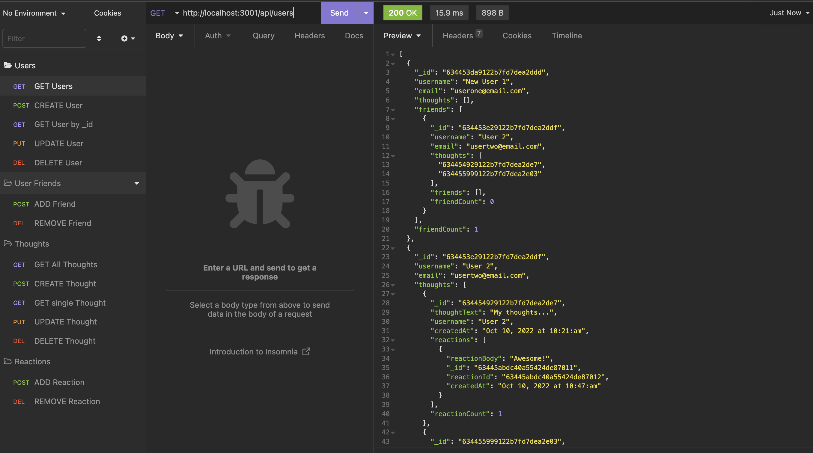
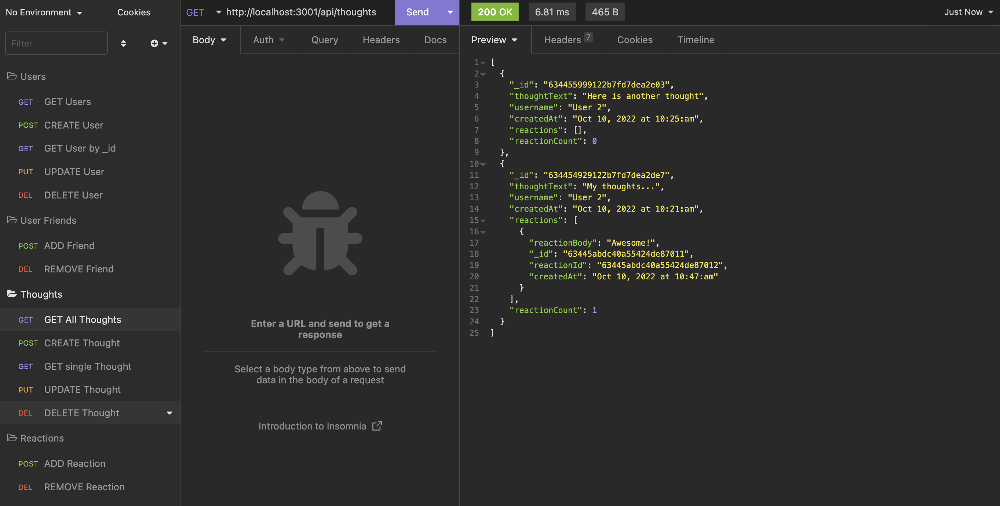

# Mongo Social API
## Description

Mongo Social is an API for a social network web application where users can share their thoughts, react to friends’ thoughts, and create a friend list. This API uses Express.js for routing, a MongoDB database, and the Mongoose ODM. In addition to using the Express.js and Mongoose packages, moment.js is used to format timestamps.

## Table of Contents

- [Installation](#installation)
- [Usage](#usage)
- [License](#license)
- [Contributors](#contributors)
- [Technologies](#technologies)
- [Questions](#questions)


## Installation
The packages required are:
```json
dependencies:
    express: 4.17.1
    moment: 2.29.4,
    mongoose: 6.0.13

devDependencies:
    nodemon: 2.0.9
```

## Usage
  
To launch this application, run `npm start` in the terminal to launch the server. All routes were tested in Insomnia. 

Click [here](https://drive.google.com/file/d/133H1AAx08BUcTNk290Jg7nX4wX9Gqthi/view?usp=sharing) for a walkthrough video of each route in Insomnia.

View the [repository](https://github.com/jmotto/Mongo-Social-API.git) for code. 

Here is an example image for the Get All Users route and also showing a friend added:


Here is an example image for the Get All Thoughts route and also showing a reaction:



## License
This application is licensed under [MIT]((https://opensource.org/licenses/MIT)). 
<br/> Copyright &copy; 2022 Jamie Otto


## Contributors
Jamie Otto

## Technologies
* JavaScript
* Node
* Express
* Mongoose


## Questions
If you have any questions about this project, please contact [jmotto31@gmail.com](mailto:jmotto31@gmail.com). To view more of my projects, go to [jmotto](https://github.com/jmotto).